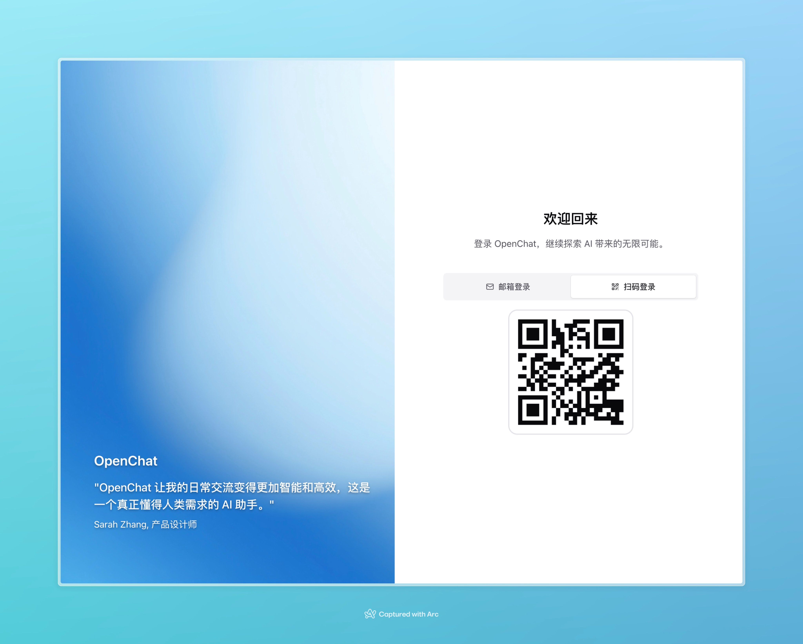
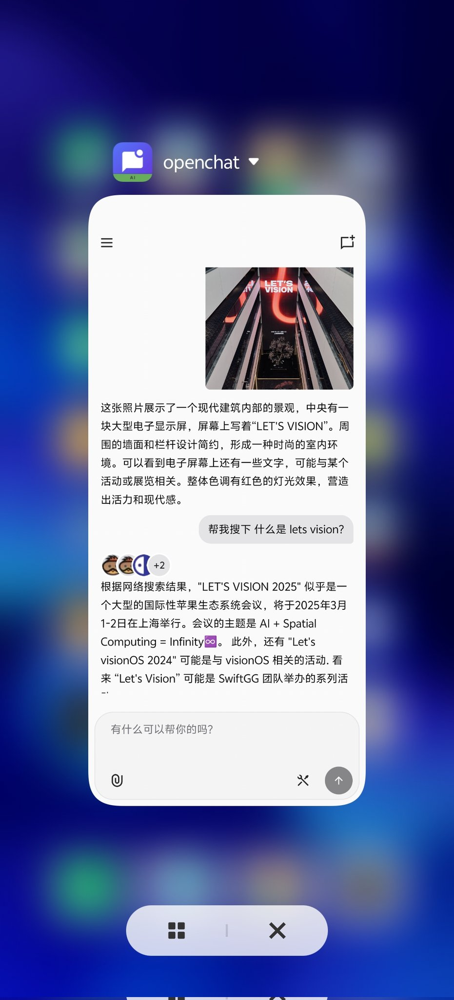
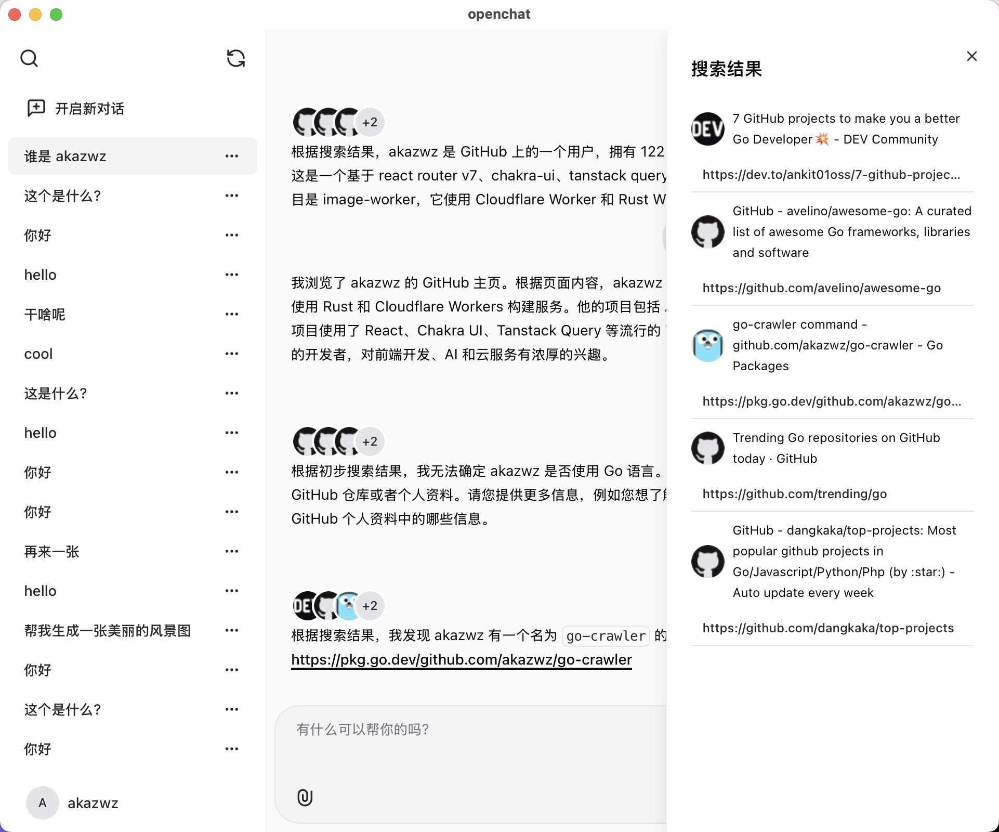

# OpenChat

<p align="center">
  
</p>

<p align="center">
  A modern, full-stack application featuring AI-powered chat capabilities, built with React and multi-backend architecture (Cloudflare Workers/Node.js/Golang), supporting cross-platform clients for web, mobile app, and desktop
</p>

<p align="center">
  <a href="#features">Features</a> •
  <a href="#tech-stack">Tech Stack</a> •
  <a href="#getting-started">Getting Started</a> •
  <a href="#deployment">Deployment</a> •
  <a href="#project-structure">Project Structure</a> •
  <a href="#contributing">Contributing</a> •
  <a href="#license">License</a>
</p>

<p align="right">
  <a href="README.md">中文</a>
</p>

---

<p align="center">
  <a href="https://chat.antonai.com" target="_blank"><strong>🔥 Live Demo</strong></a>
</p>

<div align="center">
  <p><strong>QR Code Login</strong></p>
  
  
  <p><strong>Android App</strong></p>
  
  
  <p><strong>Intelligent Search</strong></p>
  
</div>

## ✨ Why OpenChat?

OpenChat isn't just another AI chat application. It's built with a modern tech stack to provide a comprehensive AI conversation experience:

- 💪 **Full-stack TypeScript** - Type safety across frontend and backend for improved developer productivity
- 🚀 **Global Deployment** - Easily deploy worldwide with Cloudflare Workers in seconds
- 🔄 **Cross-Platform Seamless Sync** - Real-time synchronization across web, mobile, and desktop, switch devices anytime while continuing your conversations
- 📦 **Fully Featured** - Complete functionality out of the box with no additional configuration needed
- 🧩 **Highly Extensible** - Modular design makes it easy to add new models and features

## Features

- 🤖 **AI-Powered Interactions**: Integration with OpenAI GPT-4 for natural language conversations
- 🎨 **Text-to-Image Generation**: Support for Flux AI models to create images from text descriptions
- 🔍 **Web Search Capabilities**: Integrated Brave Web search functionality
- 📱 **Multi-Platform Support**: Works on both web browsers and as native applications (via Tauri)
- 📊 **Modern Database Architecture**: PostgreSQL with Drizzle ORM and Cloudflare Hyperdrive optimization
- 🔒 **Type-Safe API Communication**: Using Connect RPC and Protocol Buffers
- 📷 **QR Code Login**: Support for scanning QR codes to log in on Tauri client apps
- 🖼️ **Image Storage**: Efficient image storage with Cloudflare R2
- ⚡ **Real-time Responses**: Fast, responsive interface with modern React components
- 📲 **Three-Platform Sync**: Seamlessly switch between web, mobile, and desktop with real-time chat history synchronization

## 📥 Downloads

- [Android APK Package](https://cdn.bytepacker.com/05eb5d86-a1a1-4076-bf63-5dd810288e25/app-universal-release.apk)
- [Mac (Apple Silicon) DMG Package](https://cdn.bytepacker.com/2f02716a-d9bf-43db-b511-4fd0fd810813/openchat_0.1.0_aarch64.dmg)

## Tech Stack

### Frontend
- **Framework**: React with React Router
- **UI Library**: Chakra UI
- **Client Support**: Tauri

### Backend
- **Serverless**: Cloudflare Workers (Node.js and Golang backend implementations are in development)
- **API**: Connect RPC with Protocol Buffers
- **Type Generation**: buf

### Database
- **Database**: Neon (PostgreSQL)
- **ORM**: Drizzle ORM
- **Connection Optimization**: Cloudflare Hyperdrive

### Development Tools
- **Monorepo Management**: pnpm workspaces
- **Code Formatting**: Biome
- **Deployment**: Cloudflare

## Getting Started

### Prerequisites

- [Node.js](https://nodejs.org/) (v18 or later)
- [pnpm](https://pnpm.io/)
- [Wrangler CLI](https://developers.cloudflare.com/workers/cli-wrangler/install-update/)
- [buf CLI](https://buf.build/docs/installation)

### Installation

1. Clone the repository:
   ```bash
   git clone https://github.com/akazwz/openchat-monorepo.git
   cd openchat-monorepo
   ```

2. Install dependencies:
   ```bash
   pnpm install
   ```

3. Set up environment variables:
   ```bash
   # Create environment files based on examples
   cp packages/workers/.env.example packages/workers/.env
   cp packages/frontend/.env.example packages/frontend/.env
   ```

4. Generate Protocol Buffer types:
   ```bash
   pnpm gen
   ```

### Development

Start the development servers:
```bash
pnpm dev
```

This will start both the frontend and Cloudflare Worker in development mode.

## Deployment

Deploy the application to Cloudflare:
```bash
pnpm fly
```

## Project Structure

```
├── packages
│   ├── frontend         # React frontend application
│   ├── workers          # Cloudflare Workers backend service
│   ├── nodejs           # Node.js backend implementation
│   └── golang           # Golang backend implementation
├── proto                # Protocol Buffer definitions
```

## Contributing

Contributions are welcome! Feel free to submit a Pull Request.

## License

We're still deciding which open source license to use. Stay tuned! If you have any suggestions or thoughts, we'd love to hear them.

---

## ⚠️ Warning

**This project is currently under active development.** Features may change, APIs may be unstable, and there might be bugs. Use in production environments at your own risk.

---